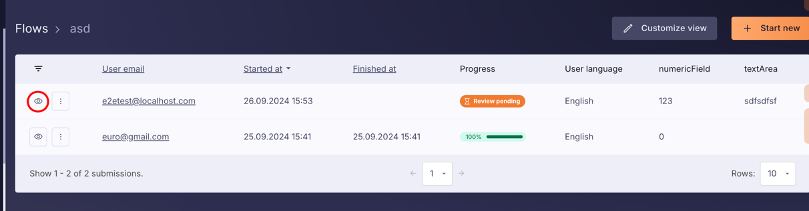
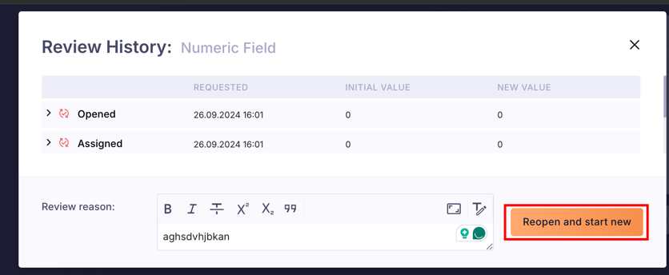

(defn- element-from-preview
[preview-data ele-name]
(->>
(mapcat :elements (-> preview-data :summary :computed-elem :page-data))
(filter #(= ele-name (-> % :computed-elem :name)))
(map (comp :id :computed-elem))
first))

apply-get-form-preview
/api/bcc/filled-form/ff-uuid

create-review
api/bcc/filled-form/:ff-uuid/reviews/invite

FN not exist! 
api/bcc/filled-form/:ff-uuid/submit

