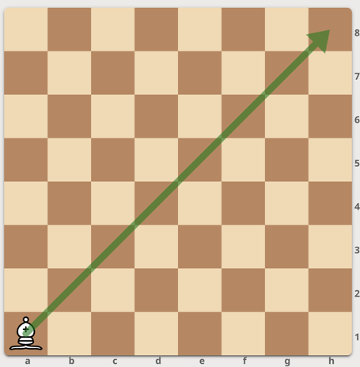
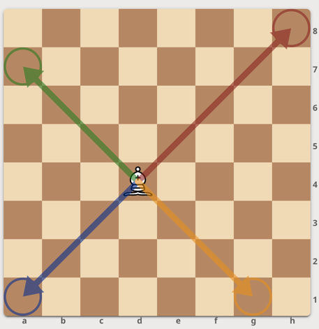
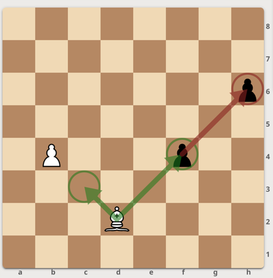

# Ders 3 - Filin Hareketi

## 3.1 Fil Hareketinin Temelleri

### *3.1-a Fil'in Temel Hareketi*

- **Hareket Yönleri:** Fil, satranç tahtasında çapraz olarak hareket edebilir.
- **Hareket Mesafesi:** Fil, bulunduğu çapraz üzerinde herhangi bir yöne hareket etmek istediği kadar kare kadar çapraz yönlerde hareket edebilir.
- **Engeller:** Fil, hareket ederken başka taşların üzerinden geçemez; yolundaki taşlara kadar hareket edebilir veya rakip taşı alarak bulunduğu kareyi işgal edebilir.
- **Stratejik Kullanım:** Filin hareket kabiliyeti, çapraz hatlarda geniş bir alanı kontrol edebilmesi nedeniyle güçlüdür. Fil, özellikle aynı renkteki karelerde hareket eder ve tahtanın köşelerinde veya çapraz hatlarda güçlü konumlar oluşturabilir. Filler satranç oyunun her bölümünde oldukça etkili taşlardır, açılış ve oyun ortasında oldukça güçlüdürler. Oyun sonunda ise yeterli taşlardır. Fillerin açmaz tehtidleri bitirici olabilir.

### *3.1-b Örneklerle Fil'in Hareketi*

#### **Örnek 1:**

- **Açıklama:** Fil, aynı çaprazda hareket ederek a1'den h8'e kadar ilerleyebilir.
- **Adımlar:**
  1. a1 karesine fil koyalım.
  2. a1 karesindeki fil aynı çaprazda hareket ederek h8'e kadar ilerleyebilir.

  

#### **Örnek 2:**

- **Açıklama:** Fil, aynı çaprazda sol üstten sağ alta hareket ederek d4'ten a7'ye kadar ilerleyebilir.
- **Adımlar:**
  1. Fil d4'te başlar.
  2. Aynı çaprazda hareket ederek a7'ye kadar ilerleyebilir hatta yukarı ve aşağı çaprazlara doğru da hareket edebilir.

#### **Örnek 3:**

- **Açıklama:** Fil, başka taşların üzerinden atlayamaz.
- **Adımlar:**
  1. Fil d2'de, kendi taşı b3'te ve rakip taşlar f4'de ve h6'dadır.
  2. Fil, c3'e kadar hareket edebilir ancak b3'te bulunan kendi taşını geçemez çünkü kurallar gereği kendi taşlarımızı yiyerek tahtadan çıkartamayız.
  3. Fil, f4'e kadar hareket edip rakip taşı alabilir çünkü rakip taş bizim taşımız değildir.
  4. Fil, d2 karesinden direkt olarak h6 karesindeki taşı yiyemez çünkü f4 karesinde rakibin taşı vardır ve filler taşların üzerinden atlayamaz. Tek bir hamlede sadece bir taş alabiliriz ya da tek bir yönde hareket edebiliriz.

  

## 3.2 Fil ile Saldırı Yapma

### *3.2-a Fil ile Saldırı Yapmanın Temelleri*

Fil, satranç tahtasında çapraz hatlar boyunca hareket ederek rakip taşlar üzerinde baskı kurabilir. Fil ile saldırı yaparken bazı temel stratejileri dikkate almak önemlidir:
Filler, çapraz hatlar boyunca ilerleyerek rakip taşlara ciddi tehditler oluşturabilir. Bu nedenle, oyunun ilerleyen aşamalarında filler merkezde veya açık çapraz hatlarda konumlandırılması, bu taraf için büyük bir stratejik avantaj sağlar. Merkezde konumlanmış filler, tahtanın her iki tarafına da hızla müdahale edebilir ve hem savunma hem de saldırı için esnek bir pozisyon sunar. Fil, özellikle çapraz hatlarda ve rakibin savunma zayıflıklarını hedef aldığında, güçlü bir saldırı aracı haline gelir.

### *3.2-b Örneklerle Fil ile Taş Alma ve Saldırı/Tehdit Yapma*

#### **Örnek 1:**

- **Konu:** Taş alma örneği.
- **Açıklama:** Fil f1'de ve rakip taş d3'te ise, fil d3'e giderek taşı alır.
- **Adımlar:**
  1. Fil f1'de konumlanmıştır.
  2. Rakip taş d3'te bulunmaktadır.

    

  3. Fil, f1'den d3'e doğru hareket eder ve rakip taşı alır.

    

#### **Örnek 2:**

- **Konu:** Saldırı/Tehdit Yapma Örneği.
- **Açıklama:** Fil c1'de, rakip taş ise g5'te bulunuyorsa, fil g5'e giderek rakip taşına tehdit oluşturur.
- **Adımlar:**
  1. Fil c1'de konumlanmıştır.
  2. Rakip taş g5'te yer almaktadır.
  3. Fil, çapraz olarak c1'den g5'e kadar ilerler ve hamlesi sonucunda rakip taşını tehdit edecek pozisyona gelir.
     Rakip müdahale etmezse, bir sonraki hamlede bu taşı alabiliriz. Bu duruma tehdit oluşturma veya saldırı yapma
     denir.

  

  4. g5 karesine ulaşıldığında, rakip taş alınır ve fil g5'e yerleşir.

## 3.3 Fil ile Savunma Yapma

### *3.3-a Fil ile Savunma Yapmanın Temelleri*

Filler, satrançta sadece saldırı aracı olarak değil, aynı zamanda savunma unsuru olarak da büyük bir rol oynar. Fil,
özellikle oyun sonlarında diğer taşları korumak ve savunma yapmak için stratejik noktalara yerleştirilebilir. Fillerin
savunmadaki temel rolü, şahı ve diğer önemli taşları tehditlerden koruyacak güvenli pozisyonlarda bulunmaktır. Bu
sayede, rakibin tehditlerine karşı bir güvenlik ağı oluşturur.

Filler, kontrol ettikleri çapraz hatlar boyunca rakip saldırılarını engelleyebilir. Rakip taşların bu hatlardan
ilerlemesini zorlaştırarak savunma hattını güçlendirirler. Bu noktada, filler diğer taşlarla koordineli çalışarak,
rakibin saldırılarına karşı daha güçlü bir savunma hattı oluşturabilir ve tehditlere karşı daha etkili bir koruma sağlar.
Bu şekilde, filler savunmada kritik bir rol oynar ve oyun boyunca dengeyi korumaya yardımcı olur.

### *3.3-b Örneklerle Fil ile Savunma Yapma*

#### **Örnek 1:**

- **Açıklama:** Beyaz fil c1'de ve siyah piyon f4'te. Beyaz fil son hamlesinde c1 karesine geçerek siyahın f4
  karesindeki piyona tehdit oluşturmuştur. Siyah için bu piyonu korumak önemlidir, aksi takdirde beyaz fil piyonu
  alabilir ve siyah taş kaybedebilir. Siyah, g8 karesindeki kalesini d8 karesine getirerek savunma yapabilir. Bu
  hamleyle, siyahın kalesi f4 karesindeki piyonu koruma altına alır. Eğer beyaz fil, bu piyonu almak için hamle
  yaparsa, siyah kale hemen karşılık verip f4 karesindeki beyaz fili alabilir ve bu durum beyazın taş kaybetmesine
  neden olur. Bu yüzden, beyazın piyonu alması stratejik olarak iyi olmayacaktır. Bu senaryo, siyahın başarılı bir
  savunma hamlesi yaptığını gösterir.

- **Adımlar:**
  1. Beyaz fil c1'de yer alır ve siyah piyon f4'te bulunur.
  2. Beyaz fil, siyah piyonuna tehdit oluşturur.
  3. Siyah, g8 karesindeki kalesini d8 karesine getirir.
  4. Siyah kale, f4 karesindeki piyonu korur.
  5. Beyaz fil, f4 karesindeki piyonu almaya çalışırsa, siyah kale bu hamleye karşılık verir ve beyaz fili alır.

  

#### **Örnek 2:**

- **Açıklama:** Fil d3'te ve şah d4'teyken

, rakibin kalesi b8'de. Rakibin kalesi, filin d3 karesinde konumlanmış
şahı tehdit ediyor. Bu durumda, fil ve şah koordineli hareket ederek savunma yapabilir. Fil, şahı b8'deki
rakip kaleye karşı korur ve rakip taşın şahı tehdit etmesini engeller.

- **Adımlar:**
  1. Fil d3'te, şah d4'te ve rakip kale b8'de.
  2. Fil, şahı koruma altına alır ve rakibin kalesinin şahı tehdit etmesini engeller.

  
